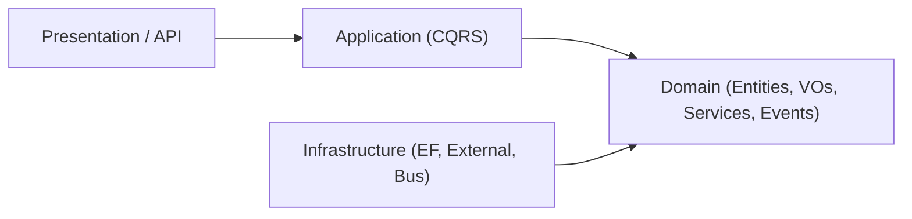
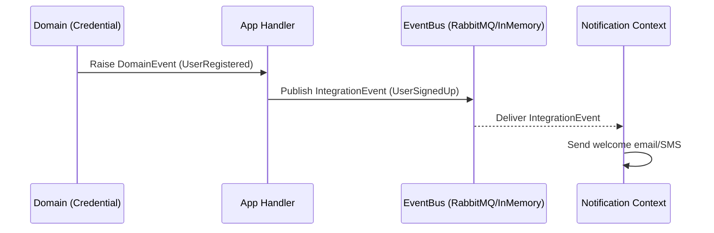

# 🧠 CSNP Platform — High‑Level README

Một trang duy nhất, tóm tắt **những điều cần nhớ** để làm việc nhất quán trên dự án CSNP: kiến trúc, DDD, CQRS, SeedWork vs SharedKernel, quy ước class/modifier, event‑driven, DB/migrations, REST, Git, và checklist làm tính năng.

---

## 📑 Table of Contents
- [1) Architecture Overview](#1-architecture-overview)
- [2) Core Principles](#2-core-principles)
- [3) Clean Layers & Dependencies](#3-clean-layers--dependencies)
- [4) Bounded Contexts](#4-bounded-contexts)
- [5) SeedWork vs SharedKernel](#5-seedwork-vs-sharedkernel)
- [6) CQRS & Application Layer](#6-cqrs--application-layer)
- [7) Class Design & Access Modifiers](#7-class-design--access-modifiers)
- [8) Event‑Driven Communication](#8-event-driven-communication)
- [9) Database & Migrations](#9-database--migrations)
- [10) REST API Notes](#10-rest-api-notes)
- [11) Git Workflow](#11-git-workflow)
- [12) Feature Checklist](#12-feature-checklist)

---

## 1) Architecture Overview
- Kiến trúc: **DDD + Clean Architecture + Modular Monolith** (sẵn sàng tách thành microservices khi cần).
- Mỗi **bounded context** là một module nghiệp vụ độc lập, có API / Application / Domain / Infrastructure riêng.
- Tất cả phụ thuộc **vào trong domain**; hạ tầng chỉ là “plugin”.

---

## 2) Core Principles
- **DDD First**: business rules ở Domain, không phụ thuộc framework.
- **Explicit Boundaries**: contexts độc lập, giao tiếp qua Integration Events.
- **CQRS**: tách đọc/ghi để tối ưu, rõ trách nhiệm.
- **Loose Coupling**: không gọi chéo code giữa contexts; dùng EventBus.
- **Production by Default**: logging, validation, health, tracing, DI, tests.

---

## 3) Clean Layers & Dependencies


- Mũi tên biểu thị **phụ thuộc**. Code luôn phụ thuộc **vào Domain** (không ngược lại).

---

## 4) Bounded Contexts
- **Credential**: Identity + Authorization (ASP.NET Identity + OpenIddict).
- **Notification**: Email/SMS/Push; tiêu thụ Integration Events để gửi thông báo.

---

## 5) SeedWork vs SharedKernel

| Aspect            | SeedWork (kỹ thuật)                                      | SharedKernel (nghiệp vụ chung)                              |
|-------------------|-----------------------------------------------------------|--------------------------------------------------------------|
| Mục tiêu          | Nền tảng DDD: base types, abstractions                    | Khái niệm domain **chung & ổn định** giữa nhiều contexts     |
| Ví dụ             | `Entity<TId>`, `ValueObject`, `IAggregateRoot`, Events    | `EmailAddress`, `PhoneNumber`, `Money`, exceptions/validators |
| Logic nghiệp vụ   | Không                                                     | Có (nhẹ, đã được team đồng thuận)                            |
| Lưu ý             | Không nhét business rules                                 | Giữ nhỏ, tránh biến thành “God module”                       |

**Ghi nhớ nhanh**  
- *SeedWork* = “bộ khung kỹ thuật DDD”, không chứa business logic cụ thể.  
- *SharedKernel* = “phần domain chung, ổn định”, chỉ thêm khi thật sự shared.

---

## 6) CQRS & Application Layer

**Định nghĩa ngắn**  
- **Commands**: thay đổi state (create/update/delete); có `Command` + `Handler` (+ `Validator`).  
- **Queries**: chỉ đọc dữ liệu; có `Query` + `Handler`.

**Tổ chức thư mục (theo feature)**
```
Application/
  Commands/
    CreateUser/
      CreateUserCommand.cs
      CreateUserHandler.cs
      CreateUserValidator.cs
  Queries/
    GetUser/
      GetUserQuery.cs
      GetUserHandler.cs
  Abstractions/
    IUserReadRepository.cs
    IUserWriteRepository.cs
```
**Best Practices**
- Handler **mỏng** (điều phối), domain xử lý nghiệp vụ.
- Không trộn đọc & ghi chung handler.
- Map DTO/ViewModel; **không** expose EF entities ra ngoài.
- Tách `ReadRepository` và `WriteRepository`.

---

## 7) Class Design & Access Modifiers

- **public**
  - Application: `Command`, `Query`, `Handler`, `Validator`, DTO.
  - Domain: Entities, ValueObjects, Enums.
  - API: Controllers, contracts.
  - Infrastructure: chỉ khi cần dùng ngoài assembly (e.g., `Program.cs`).

- **internal**
  - Mặc định cho **Infrastructure** (repo/service impl, mappers) → `internal sealed`.

- **private**
  - Field, helper methods, logic nội bộ class.

- **sealed**
  - Không cho kế thừa; bảo vệ behavior; JIT dễ tối ưu.
  - Dùng nhiều với Command/Handler/Validator & helpers.

- **abstract** / **interface**
  - `abstract`: base class có logic chung + một phần contract.
  - `interface`: hợp đồng cho DI/mock; cho phép đa implement.

**OOP Notes**: Ưu tiên **composition over inheritance**; Domain **không** phụ thuộc Infrastructure; ValueObject **immutable**.

---

## 8) Event‑Driven Communication


- **Domain Events**: nội bộ context.  
- **Integration Events**: giao tiếp giữa contexts qua EventBus.  
- Lưu ý: immutable payload, logging, retry, versioning.

---

## 9) Database & Migrations
- 1 database nhiều **schema** (ví dụ Postgres):
  - `credential` ↔ `CredentialDbContext`
  - `notification` ↔ `NotificationDbContext`
- Mỗi context có **migrations project riêng**; code chỉ chạm schema của chính mình.
- Dễ tách sang DB riêng khi scale.

---

## 10) REST API Notes
- Resource **danh từ số nhiều**: `/api/users`, `/api/users/{id}`.
- Dùng DTO cho input/output; status codes chuẩn: `200/201/204/400/401/403/404/409/500`.
- Validation với FluentValidation; lỗi trả về dạng danh sách rõ ràng.
- Hỗ trợ pagination/filter/search; document bằng Swagger/OpenAPI.

---

## 11) Git Workflow
- Branch môi trường: `dev` → `uat` → `stg` → `pro`.
- Branch công việc: `feature/*`, `bugfix/*`, `hotfix/*`, `refactor/*`.
- Tên nhánh gợi ý:
```
<type>/<ticket>-<short-desc>-<Member>
# ví dụ: feature/CSNP-123-user-authentication-ToanNV
```
- Quy trình: làm trên feature → PR vào `dev` → promote tuần tự đến `pro`.

---

## 12) Feature Checklist (nhanh)
1. Chọn **bounded context** (Credential/Notification).
2. Tạo **Command/Query** (MediatR) + **Validator** (nếu là Command).
3. Viết **Domain** (Entity/VO/Service/Events) – *không phụ thuộc infra*.
4. Implement repo/service ở **Infrastructure** (`internal sealed` + interface).
5. Cross‑context? → **IntegrationEvent + EventBus**.
6. Expose **API** (Controller + DTO + mapping).
7. Tests phù hợp (Unit/Integration/Architecture).
8. Chạy `dotnet test`, `dotnet format`.
9. Commit theo nhánh chuẩn, mở PR vào `dev`.

---
